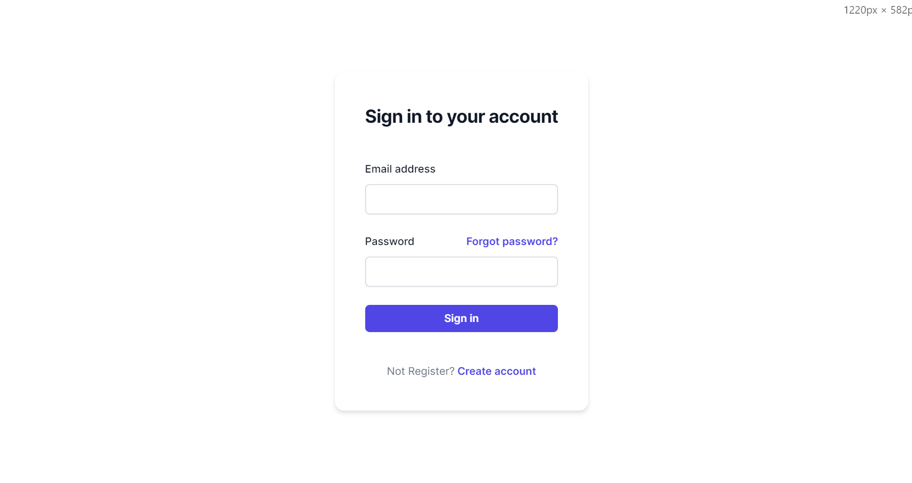
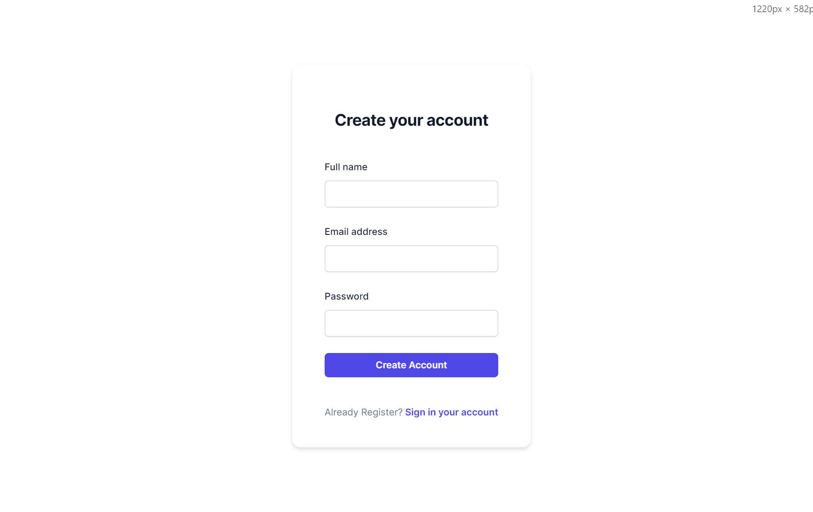
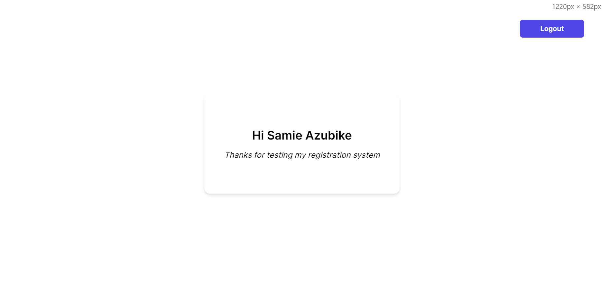

# Basic Spring Boot Registratio System

## Description
This is a basic Spring Boot registration application with signup, signin, and dashboard functionalities. It also handles data validation.

## Table of contents
  - [Screenshot](#screenshot)
  - [Links](#links)
  - [Built with](#built-with)
  - [Author](#author)

### Screenshot

### Links

- Live Site URL: [Follow this link to view the frontend](https://springbootregistrationsystem.netlify.app)

### Built with

- Spring boot framework
- React/NextJs, TypeScript
- TailWindCSS
- Next-Auth, Axios, React-hot-toast, Formik, Yup Library's
- Amazon Relational Database Services (MySQL)

## Author

- Website - [Samie Azubike](https://www.samieazubike.vercel.app)
- Linkedin - [@samieteq](https://www.linkedin/in/samieteq)
- Twitter - [@samieteq](https://www.twitter.com/samieteq)

## Note:
I'm trying to deploy the backend to AWS, so it may not be working properly with the frontend now.
